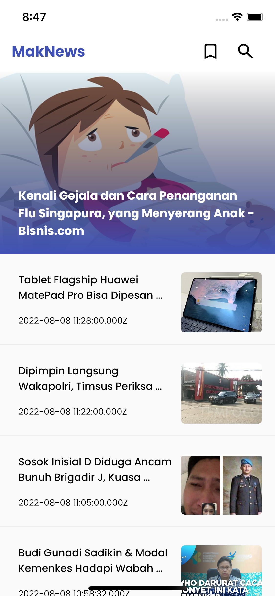
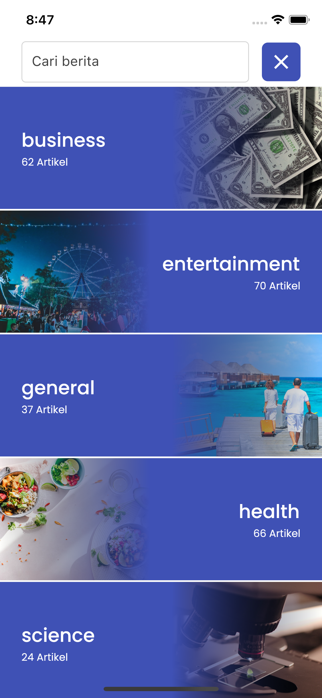
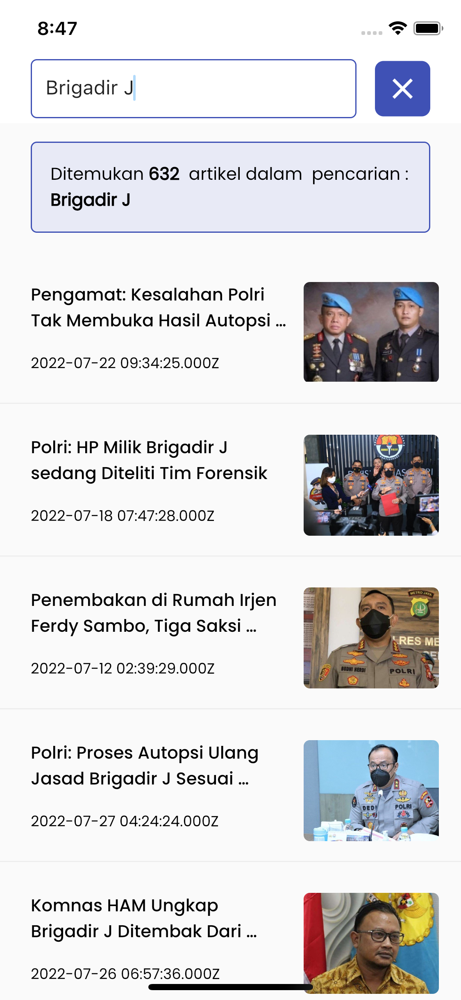

# MakNews

MakNew dibuat dengan Flutter dengan Clean Architecture menggunakan API dari NewsAPI.org v2. Packages yang digunakan :

- State Management : BLoc & Flutter BLoC
- Dartz
- Dio
- Freezed
- json_annotation
- Get it
- Injectable
- dll

## Screenshoot

  
